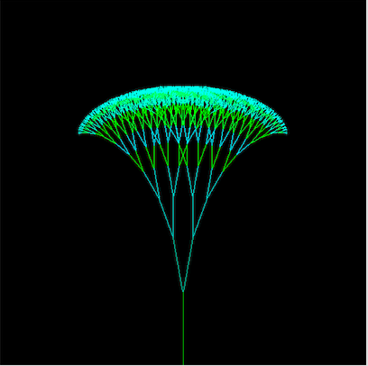

# fractal-trees
[Fractal trees](http://davis.wpi.edu/~matt/courses/fractals/trees.html) in C++

I have always been fascinated by beautiful graphics and animation. I came across this 
[super cool video by Daniel Shiffman](https://www.youtube.com/watch?v=0jjeOYMjmDU) a few weeks ago and decided to build it in C++ without using any frameworks.

The program uses Bresenham's line algorithm to draw the approximation of a line. It also uses some basic high school vector geometry. The output is stored in ppm format in Tree.ppm.

To use: Compile and run fractal-trees.cpp and input the enter the angle when prompted.

Here is are few samples:

### Branching at 10 degrees

### Branching at 30 degrees

### Branching at 50 degrees

